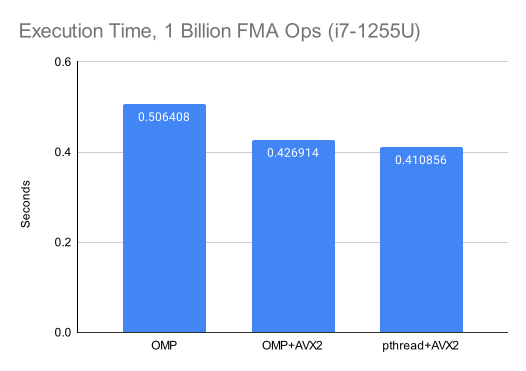

## SIMD + Multithreading + FMA in C

This is a little experiment to see what kinds of throughputs I can achieve for parallelized fused mulacc one a CPU with AVX2 and multithreading.
As it stands now, the hand-crafted implementation is roughly 16% faster than the compiler optimized naive implementation.
To compare performance, I measure the avg time taken to run one billion FMA operations each of the four buffers (a,b,c,result) holds 4GB worth of floats.
We run through the entire data 30 times as a warmup and then take the avg of 50 runs using `clock_gettime`.

### Naive implementation (OMP only)
Uses `OMP` to automatically parallelize a simple for loop.
```C
#pragma omp parallel for
for (size_t i = 0; i < N; i++) {
    result[i] = a[i] * b[i] + c[i];
}
```

> Avg execution time: 0.506408 seconds

#### Build and run naive impl:
```bash
gcc -O3 -fopenmp -march=native src/naive.c -o build/native && ./build/native
```

<hr>

### OMP-accelerated SIMD
Uses `OMP` to automatically parallelize SIMD-accelerated fused mulacc.

> Avg execution time: 0.426914 seconds.

#### Build omp/AVX2 impl:
```bash
gcc -O3 -fopenmp -mavx2 -mfma -march=native src/avx2_omp_fma.c -o build/avx2_omp_fma && ./build/avx2_omp_fma
```

<hr>

### Hand-crafted implementation
Uses `pthread` to parallelize SIMD-accelerated fused mulacc.

> Avg execution time: 0.410856 seconds

#### Build pthread/AVX2 impl:
```bash
gcc -O3 -mavx2 -mfma -pthread -march=native src/avx2_pthread_fma.c -o build/avx2_pthread_fma && ./build/avx2_pthread_fma
```


## Conclusion
Just go with OMP+AVX2. That gets you a performance benefit of around 15.7% over using OMP alone, while still being a lot less complex than the pthread impl.

